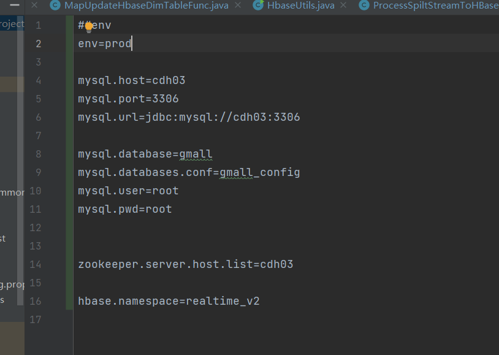
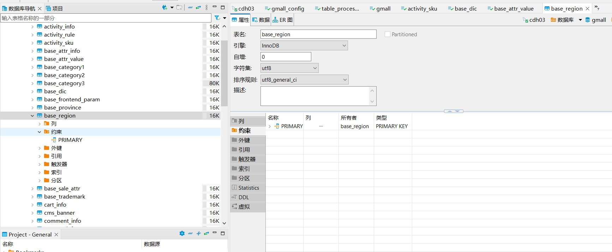

## 12.23
>今日进行了项目的二开 重新写了dim层将数据写入hbase中的维表中  
> 总体使用flinkcdc监听主表和维表 将数据读出来 然后进行广播流 进行在hbase当中建表
> 并且将数据传入hbase新建的表当中

>要 确保config的配置文件是对的
 

>其中遇到的错误有 建表的时候报primary key 缺少主键 将指定表的主键添加上就可以了
 

最后打包部署到yarn进行执行