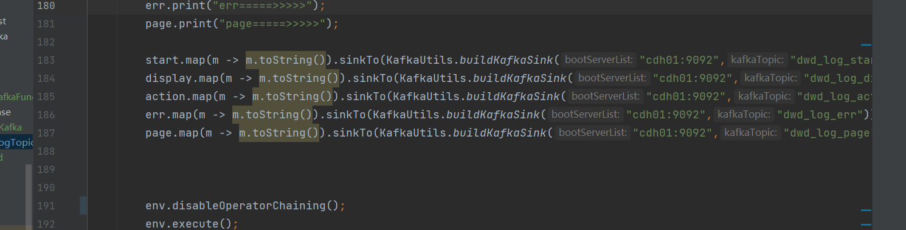
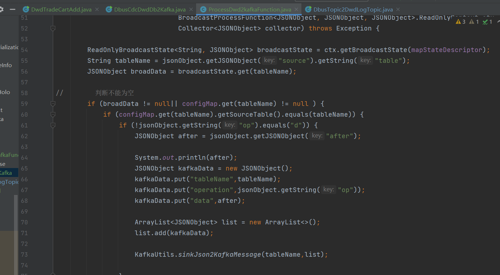

dwd层log的分流

> 使用此种写入方式 最后末尾的记得打散算子块 

dwd层db的分发
> 使用flinkCDC代替了maxwell 直接进行全表采集和finkCDC采集配置表的dwd配置表 使用广播流对数据
> ，进行kafkaTopic的分发 
> 
> 对数据进行了处理 方便查看

dwd加购表的拉宽
> 从kafka的topicDb这个主题进行读取数据 使用flinkSql对表进行拉宽 正在完善